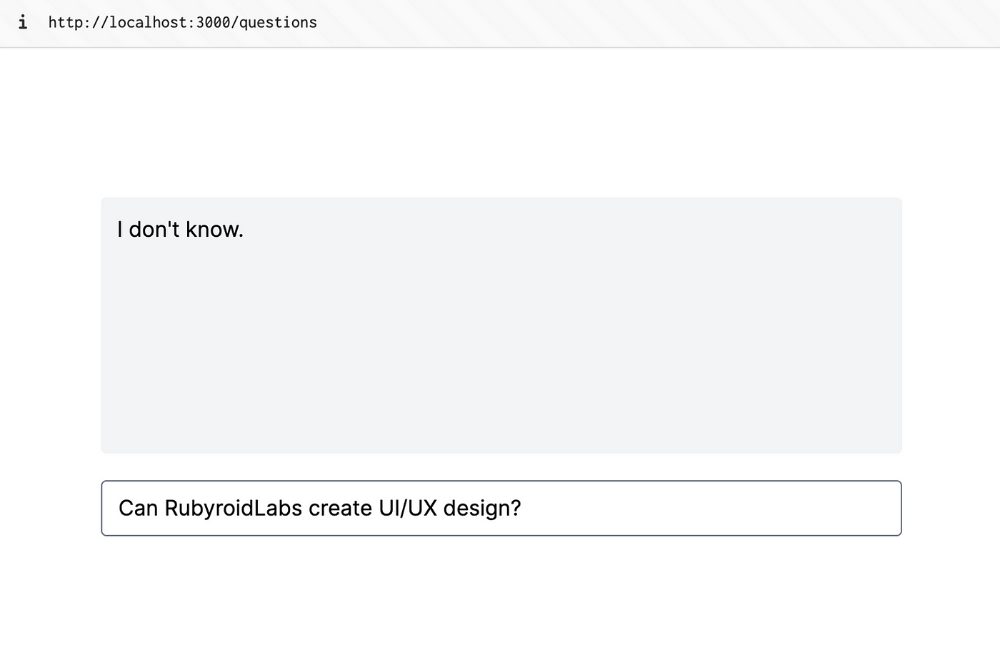

# MyGPT Project Setup

How to build an AI chatbot with Ruby on Rails and ChatGPT: https://medium.com/@rubyroidlabs/how-to-build-an-ai-chatbot-with-ruby-on-rails-and-chatgpt-9a48f292c37c

## Setup

### Initialize Ruby on Rails project with PostgreSQL

**Check environment**

```bash
ruby --version # ruby 3.2.2
rails --version # Rails 7.1.1
```

**Initialize Rails project ([docs](https://guides.rubyonrails.org/getting_started.html))**

```bash
rails new my_gpt --database=postgresql --css=tailwind
cd my_gpt
```

**Setup VSCode dev container + project config files**

```bash
# cp .devcontainer .vscode .editorconfig .rubocop.yml config in project
# from our shared config repository https://github.com/tekncoach/vscode-ruby-dev-container
```

**Setup database**

The best way to install PostgreSQL on your MacOS is not to install it at all.
Instead, just run a docker container with a required PostgreSQL version. We will use [ankane/pgvector](https://hub.docker.com/r/ankane/pgvector/tags) image, therefore we will have [pgvector extension](https://github.com/pgvector/pgvector#docker) preinstalled.

```bash
# Command from the medium article, but we will use docker-compose instead to run everything inside a dev container
# docker run -d -p 5432:5432 -e POSTGRES_PASSWORD=postgres --name my_gpt_postgres ankane/pgvector
```

Edit `docker-compose.yml` db service image to use ankane/pgvector as we need vector search :
```yaml
  db:
    image: ankane/pgvector:latest
    restart: unless-stopped
```

Add this to `config/database.yml` to the `default` or `development` section:
```yaml
default: &default
  host: db
  username: postgres
  password: postgres

#... omitted
```

VSCode : `Reopen project in container` (From command palette)

Then initialize the database structure:
```bash
bundle install
rails db:create
rails db:migrate
```

**Run the app**
```bash
bin/dev
```

## Setup PGVector

We will use the gem [neighbor](https://github.com/ankane/neighbor) to work with PGVector. If you run PostgreSQL with Docker as described above, there is no need to install and build PGVector extension. So you can move on to this:

```bash
bundle add neighbor
rails generate neighbor:vector
rails db:migrate
```

## Setup OpenAI

To make OpenAI API calls, we will use [ruby-openai](https://github.com/alexrudall/ruby-openai) gem.

```bash
bundle add ruby-openai
```

Create `config/initializers/openai.rb` file with the following content:

```ruby
OpenAI.configure do |config|
  config.access_token =  Rails.application.credentials.openai.access_token
  config.organization_id = Rails.application.credentials.openai.organization_id
end
```

Add your OpenAI API key to the credentials. You can find them in your [OpenAI account](https://platform.openai.com/account/api-keys).

```bash
EDITOR=nano rails credentials:edit
```

```yaml
openai:
  access_token: sk-xxxxx
  organization_id: org-xxxxx # Leave blank if you are on the "Personal" plan
```

## Build a simple chat with [Hotwired](https://hotwired.dev/)

Create Questions controller `app/controllers/questions_controller.rb`:
```bash
rails g controller Questions index create
```

```ruby
# app/controllers/questions_controller.rb
class QuestionsController < ApplicationController
  def index; end

  def create
    @answer = "I don't know."
  end

  private

  def question
    params[:question][:question]
  end
end
```

Add/Edit routes to `config/routes.rb`:
```ruby
resources :questions, only: [:index, :create]
```

Create/Edit chat layout in `app/views/questions/index.html.erb`:
```html
<div class="w-full">
  <div class="h-48 w-full rounded mb-5 p-3 bg-gray-100">
    <%= turbo_frame_tag "answer" %>
  </div>

  <%= turbo_frame_tag "new_question", target: "_top" do %>
    <%= form_tag questions_path, class: 'w-full' do |f| %>
      <input type="text"
             class="w-full rounded"
             name="question[question]"
             placeholder="Type your question">
    <% end %>
  <% end %>
</div>
```

Display the answer with turbo stream.
Create file `app/views/questions/create.turbo_stream.erb` and fill it with:
```ruby
<%= turbo_stream.update('answer', @answer) %>
```

Done 🎉
Open http://localhost:3000/questions and check it out.



